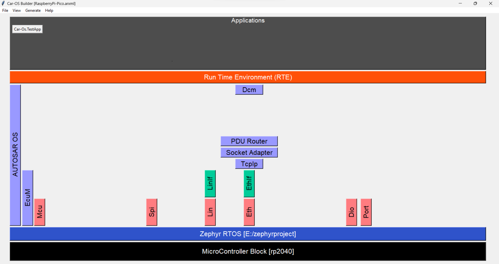

# Car-OS
The Car here stands for <u>C</u>lassic <u>a</u>utosa<u>r</u>. This runs on top of Car-OS.Zephyr project. Refer [Car-OS.Zephyr](https://github.com/aananthcn/autosar_os-zephyr) for more details. This work is a fork from [NammaAUTOSAR](https://github.com/aananthcn/NammaAUTOSAR). To know more about the history of it, please have a look.

If you invoke `python car-os/tools/autosar-gui.py` from terminal and you get the GUI as shown below. And this is referred as Car-OS Builder. 

This project is created this way for following reasons:
 * Zephyr OS supports variety of boards and therefore this project can easily support any hardware with little effort.
 * And, MCAL will use Zephyr RTOS's standard interfaces. So, no business of updating MCALs ($$ savings) across micros, henceforth.
 * People working on this project can focus on new ideas or on AUTOSAR specs than re-doing what Zephyr OS team had done it.
 * [Linux Foundation is making effort to get Safety (SIL3) certification](https://www.zephyrproject.org/update-safety-standard-compliance/). So this work could/will be used on Cars one day.

  

# Getting Started

## Prerequisites - Windows
* Windows 10 + MSYS2
  * Follow the instructions given in "Installation" section in https://www.msys2.org/
  * Install following packages by starting the **MSYS2 MSYS** terminal:
    * `pacman -Suy` 
    * `pacman -S mingw-w64-x86_64-python mingw-w64-x86_64-tk mingw-w64-x86_64-python-pip`
    * `pip install colorama`
    * `pacman -S mingw-w64-x86_64-arm-none-eabi-gcc mingw-w64-x86_64-qemu`
   * Install the following package for Gtk and Glade
   *  `pacman -S mingw-w64-x86_64-python-gobject mingw-w64-x86_64-gtk3`
  * Create envirnomental variable with **VARIABLE NAME** as **MINGW_ROOT** and **VARIABLE VALUE** as **installation path** (e.g., C:\msys64\mingw64)

 

## Prerequisites - Linux:
* Ubuntu 20.04 OS (either on Linux or on WSL2 inside Windows)
  * Install following packages inside Ubuntu
    * `apt install gcc-arm-none-eabi qemu-system-arm gdb-multiarch python3`

  

Getting / Pulling the latest changes
===
* Do the following to get the latest changes from the main and submodules
  * `git pull`
  * `git submodule update --recursive --remote`
* After this, do not forget to pull the applications (apps are loosely coupled) manually as below
  * `cd submodules/AL/Car_Os_TestApp`
  * `git pull`

If all steps above are successfull you are now ready to continue your contribution.

 

Cloning the Repo - Fresh Start
===
As Car-OS.Zephyr uses git submodules, please use the following command to clone the main and submodules
* `git clone --recurse-submodules -j4 https://github.com/aananthcn/Car-OS.Zephyr.git`

 

Starting the Car-OS.Zephyr GUI
===
* To start the Car-OS.Zephyr Builder GUI, first open the **MSYS2 MINGW64** terminal
* Navigate to the cloned repository
* Run this command in the **MSYS2 MINGW64** terminal: `python tools/autosar-gui.py`
* **Car-OS.Zephyr Builder** GUI will open

 

Importing ARXML
---
* To import ARXML, go to File --> Import ARXML File. It will give 3 different ARXML like below

* **NOTE:** It is advised to go with RaspberryPi-Pico.arxml for now, as it is tested and working well
* Select RaspberryPi-Pico.arxml and click on Open. AUTOSAR Layered Architecture view will open
* **NOTE:** Since this project in initial phase, only few modules are presented in the layered view

 

Configuration
----
* Click on the any AUTOSAR module (i.e., colored rectangle boxes; e.g., Spi), another window will open for configuration of various parameters
* Once all the configuration is done, the click on **Save Config** to update the changes and close the module specific window
* Repeat the steps for all the necessary modules

  

Importing Car_Os_TestApp
===
* Click on **Applications** (1) and wait for the clone operation to complete.
* Mention how many number of applications you want to import. In this case, I have given as 1
* Provide the **Car_Os_TestApp** repository path in the App 0 - `https://github.com/aananthcn/Car_Os_TestApp.git`

* This will automatically import the Car_Os_TestApp into respective folder

  

Code Generation
===
* Once all the configuration is done, click on the **Generate --> Generate Source**
* If all the changes are proper, then a popup with this message will be shown **Code Generated Successfully!**

* Close the Car-OS.Zephyr Builder GUI

 

Generate the ELF File
===
* In the MSYS2 MINGW64 terminal, type **make**
* This process will take sometime as it needs to compile all the source files and link them to generate the ELF file

 

Test it on Real Hardware
===
* If you have real hardware *Raspberry Pi Pico*, then flash the generated *\*.elf* file and test it

